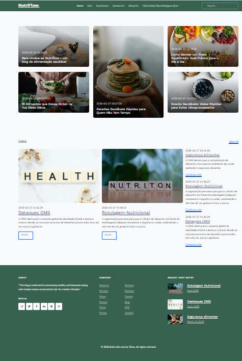
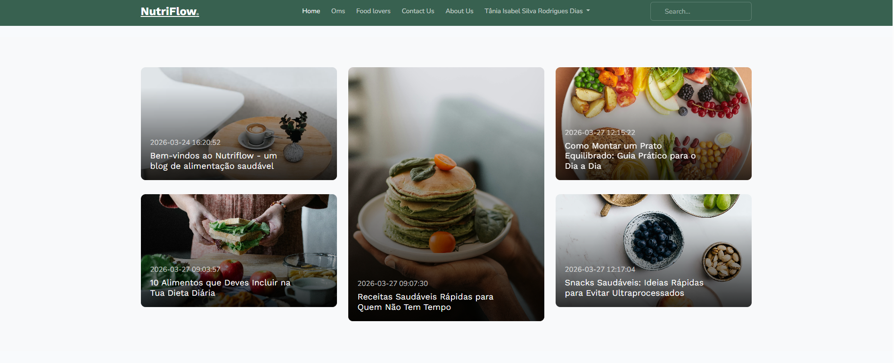
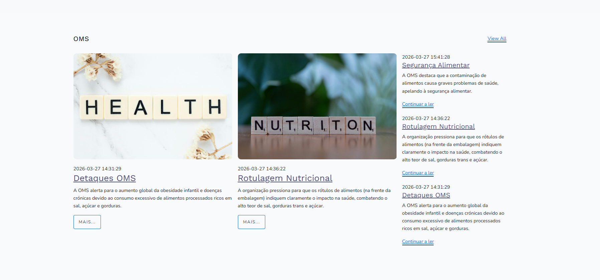
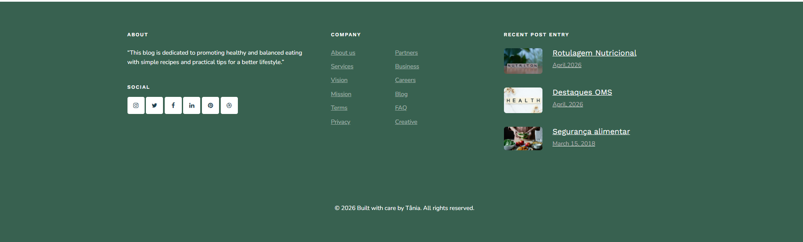

# 🌿 NutriFlow - Laravel Blog

A study project built with Laravel, created while learning the framework and PHP.

---

##  About the project

**NutriFlow** is a blog application currently under development using Laravel.

- At the moment, the project only includes the **Home Page**  
- It is being built as part of my learning journey with Laravel and PHP  
- The goal is to evolve into a full blog with authentication, categories, and post management

---

##  Project status

 In development  
 Learning project (Laravel + PHP)  
 Only the Home Page, Login and Register has been implemented so far

---

## Technologies used

- PHP
- Laravel
- Blade Templates
- MySQL
- HTML / CSS
- Bootstrap
- Vite

---

##  Screenshots

###  Full Home Page overview


---

###  Top section of the Home Page


---

###  Middle section (posts and content blocks)


---

###  Footer section


---

##  Project structure

- `app/` → application logic (controllers, models)
- `routes/` → application routes
- `resources/views/` → Blade templates (frontend)
- `public/` → public assets and entry point
- `database/` → migrations and database structure
- `config/` → Laravel configuration files

---

##  How to run the project

```bash
composer install
npm install
cp .env.example .env
php artisan key:generate
php artisan migrate
php artisan serve
npm run dev
